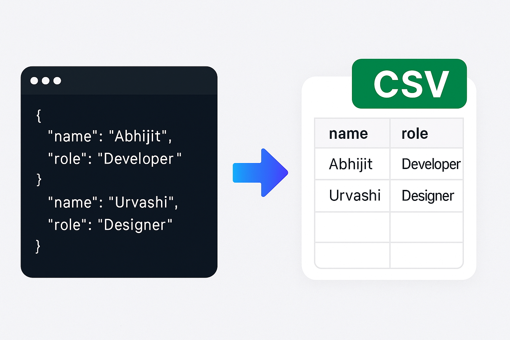

# JSON Formatter Tool

A powerful yet simple tool for formatting, validating, and transforming JSON data with ease.

## Features

- **JSON Formatting**: Instantly transform unreadable JSON into a beautifully formatted structure with proper indentation
- **JSON Validation**: Real-time error detection with detailed error messages and line highlighting
- **Format Conversion**: Transform JSON to CSV, XML, or YAML with one click
- **JSONPath Explorer**: Easily navigate complex JSON structures and generate JSONPath expressions
- **Dark/Light Mode**: Easy on the eyes with theme support for day and night usage
- **100% Browser-Based**: All processing happens in your browser - data never leaves your computer
- **Drag & Drop Support**: Upload JSON files via drag & drop or file selection
- **No Dependencies**: Lightweight implementation with vanilla JavaScript

## Security

All JSON processing happens entirely in your browser. We don't receive, collect, store, or have access to any of your JSON data. Your information remains completely private and secure.

## Demo

Visit the live site at [jsonformattertool.com](https://jsonformattertool.com)

## Local Development

Clone the repository and open `index.html` in your browser to use the tool locally:

```bash
git clone https://github.com/louieabhijit/jsonformattertool.git
cd json-formatter-tool
```

Simply open `index.html` in your browser to start using the tool locally.

## Screenshots



## License

This project is licensed under the MIT License - see the LICENSE file for details. # jsonformattertool
# jsonformattertool
# jsonformattertool
